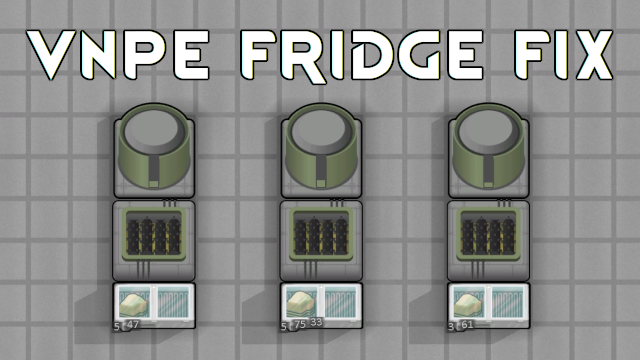

# VNPE Fridge Fix

If you want to use fridges as hoppers with [Vanilla Nutrient Paste Expanded](https://steamcommunity.com/sharedfiles/filedetails/?id=2920385763), then, at some moment, you may find that grinders do not pick ingredients from fridges despite that there's more than enough stuff.

This is because VNPE internally does not expect more than one stack in the hopper, and skips next stacks if it encounters an insufficeint one.

This mod fixes that. And, as a bonus, all cells of adjacent fridges are processed now, so you can put 2x2 fridge next to a grinder, and all items from the fridge will be processed.

## Verified compatible/supported mods

- [Simple Utilities: Fridge](https://steamcommunity.com/sharedfiles/filedetails/?id=2645100914)
- [RimFridge: Now with Shelves!](https://steamcommunity.com/sharedfiles/filedetails/?id=2898411376)
- [Fridges Are Hoppers](https://steamcommunity.com/sharedfiles/filedetails/?id=2894860548)

## You may also like...

## Support me

 or [Patreon](https://www.patreon.com/zed_0xff)
